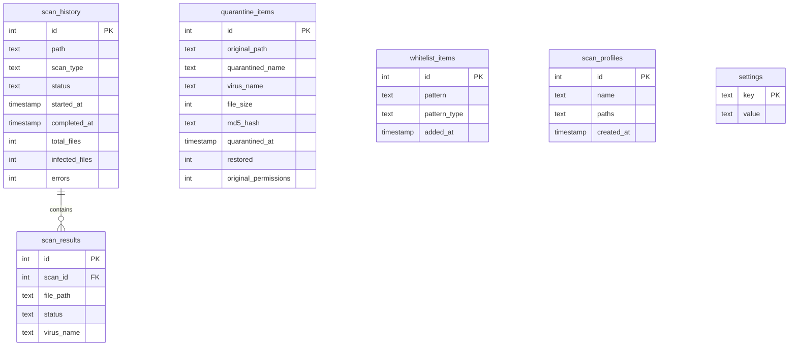
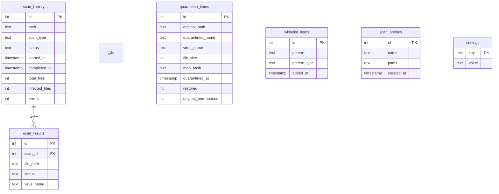

<!-- ======================================================================= -->
<!-- ENGLISH                                                               -->
<!-- ======================================================================= -->

# ClamProtect — Modern ClamAV GUI

> Real-time malware protection for Linux — built with Python & PyQt6

**ClamProtect** is a desktop antivirus application that brings a modern graphical interface to [ClamAV](https://www.clamav.net/). It offers on-demand scanning, real-time file monitoring, scheduled scans, quarantine management, and system tray integration — all without requiring a server daemon.

---


---
## Features

| Feature | Description |
|---------|-------------|
| **On-Demand Scan** | Drag-and-drop or browse files/folders; recursive scan support |
| **Quick Scan** | One-click scan of 5 common infection vectors (/tmp, /home, etc.) |
| **Real-Time Monitoring** | Watch directories for new/modified files; auto-scan + auto-quarantine |
| **On-Access Scanning** | clamonacc integration — scans files on open/exec/close |
| **Scheduled Scans** | Daily / Weekly / Monthly via system crontab |
| **Quarantine** | Isolate threats with one click; restore (with SUID stripping) or delete; integrity verification |
| **Scan History** | Per-scan results with infected/clean breakdown; stats cards (today / month / year); CSV export |
| **Scan Cancel** | Cancel a running scan at any point — both clamd and clamscan engines |
| **Scan Profiles** | Save/edit/delete named path sets; import/export as JSON |
| **Security Audit Dashboard** | 8 system-hardening checks: firewall, AppArmor, SELinux, SSH config, open ports, Lynis, rootkit scanners, ClamAV |
| **VirusTotal Integration** | Post-scan hash lookup via VirusTotal API v3; results appear inline in scan table |
| **USB Drive Auto-Scan** | Automatically scan newly mounted USB drives and network mounts |
| **Notifications** | Tray notifications on scan start, completion, threat detection, and errors |
| **Dark & Light Themes** | Auto-follows GNOME color-scheme; manual override |
| **System Tray** | Minimize to tray; background monitoring with context menu |
| **Definitions Auto-Update** | One-click or scheduled `freshclam` update |
| **CLI Tools** | 7 subcommands: `scan`, `status`, `history`, `quarantine`, `profile`, `settings`, `virustotal` |
| **File Manager Integration** | Nautilus extension (+ Dolphin service menu) — right-click scan from file manager |

---

## Requirements

- **OS**: Linux (Ubuntu 24.04+, Debian 12+, Fedora 38+, Arch Linux)
- **Python**: 3.10+
- **ClamAV**: `clamav-daemon` (clamd) and/or `clamav` (clamscan CLI)
- **Display**: X11 or Wayland (PyQt6)

### Quick Install Dependencies

```bash
# Install ClamAV
sudo apt install clamav clamav-daemon      # Debian/Ubuntu
sudo dnf install clamav clamd              # Fedora
sudo pacman -S clamav                      # Arch

# Ensure clamd is running
sudo systemctl enable --now clamav-daemon
```

### Freshclam / Definitions Update Troubleshooting

The `clamav-freshclam.service` is **disabled** and **inactive** by default on many distributions. ClamProtect calls `freshclam` directly (not via systemd). For this to work as a non-root user:

```bash
# 1. Check service status
sudo service clamav-freshclam status

# 2. Fix ownership so your user can write the database and log
sudo chown $USER: /var/log/clamav/freshclam.log
sudo chown $USER: /var/lib/clamav/ -R

# 3. Verify it works
freshclam -v --user=$USER --show-progress
```

After these steps, ClamProtect's "Update Definitions" button and scheduled updates will work without root. The application's `DefinitionsManager.update()` runs `freshclam --stdout` which respects the same permissions.

---

## Installation

### From Source

```bash
git clone https://github.com/hmidani-abdelilah/ClamProtect.git
cd ClamProtect

# Create virtual environment (recommended)
python3 -m venv .venv
source .venv/bin/activate

# Install dependencies
pip install -r requirements.txt
```

### Install System-Wide

```bash
sudo pip install .
```

This installs the `clamprotect` command, the `.desktop` file, and the SVG icon.

### Building Packages from Source

You can build installable packages directly from the source tree without any additional dependencies beyond the standard build tools:

#### .deb (Debian/Ubuntu)

```bash
sudo apt install dpkg-dev debhelper dh-python python3-all python3-setuptools
dpkg-buildpackage -us -uc -b
```

The `.deb` package is written to the parent directory as `clamprotect_1.0.1-1_all.deb`.

#### .rpm (Fedora/RHEL)

```bash
# On Fedora/RHEL:
sudo dnf install rpm-build python3-devel python3-setuptools
rpmbuild -bb clamprotect.spec

# On Debian/Ubuntu (via alien):
sudo apt install alien
alien --to-rpm ../clamprotect_1.0.1-1_all.deb
```

The `.rpm` package is written to `~/rpmbuild/RPMS/noarch/` (native) or the current directory (alien).

#### AppImage

```bash
# 1. Prepare AppDir
bash packaging/build-appimage.sh

# 2. Download appimagetool (one time)
wget -O packaging/appimagetool https://github.com/AppImage/AppImageKit/releases/download/continuous/appimagetool-x86_64.AppImage
chmod +x packaging/appimagetool
wget -O packaging/runtime-x86_64 https://github.com/AppImage/type2-runtime/releases/download/continuous/runtime-x86_64

# 3. Build AppImage
ARCH=x86_64 ./packaging/appimagetool --runtime-file packaging/runtime-x86_64 \
    packaging/AppDir packaging/ClamProtect-1.0.1-x86_64.AppImage
```

The portable AppImage is written to `packaging/ClamProtect-1.0.1-x86_64.AppImage` (~90 MB).

---

## Usage

### GUI Overview

ClamProtect's main window has 6 tabs:

| Tab | Description |
|-----|-------------|
| **Scan** | Drag-and-drop or browse files/folders; profile selector, Quick Scan, Home Directory buttons; live progress bar + threat alerts |
| **History** | Per-scan results table with infected/clean breakdown; stats cards (today / month / year); CSV export button |
| **Quarantine** | List of isolated threats; restore (SUID stripped) or permanently delete; integrity verification |
| **Scheduler** | Create/manage scheduled scans (daily/weekly/monthly) via system crontab |
| **Security Audit** | 8 system-hardening checks (firewall, AppArmor, SELinux, SSH, ports, Lynis, rootkits, ClamAV); colour-coded results |
| **Settings** | 7 subtabs: General, Appearance, Monitoring, VirusTotal, On-Access, USB Scanning, About |

### CLI Reference

```bash
# Launch GUI
clamprotect

# Subcommands (7 total) — for scripting and automation:
clamprotect scan <path> [--quick] [--profile <name>] [--json]
clamprotect status [--json]
clamprotect history [--limit N] [--json]
clamprotect quarantine <list|restore|delete> [id] [--json]
clamprotect profile <list|save|delete|export|import> [args] [--json]
clamprotect settings <get|set> <key> [value]
clamprotect virustotal <file>

# Legacy flags (also work):
clamprotect --scan /path/to/scan              # CLI scan mode
clamprotect --scan /path --silent             # Suppress output
```

**CLI examples:**

```bash
clamprotect status                            # System status
clamprotect status --json                     # Machine-readable output
clamprotect history --limit 10 --json         # Last 10 scans as JSON
clamprotect scan /home/user/Documents         # Scan specific path
clamprotect scan --quick                      # Scan 5 common locations
clamprotect scan --profile work               # Scan saved "work" profile
clamprotect quarantine list                   # List quarantined items
clamprotect quarantine restore 3              # Restore item #3
clamprotect quarantine delete 3               # Permanently delete item #3
clamprotect profile list                      # List saved profiles
clamprotect profile save work /home/work/     # Save profile
clamprotect profile delete work               # Delete profile
clamprotect profile export --file profiles.json
clamprotect profile import --file profiles.json
clamprotect settings get notifications        # Read setting
clamprotect settings set theme dark           # Write setting
```

### Scheduled Scan (via crontab)

The scheduler tab in the GUI writes entries to the user's crontab:

```
0 2 * * * python3 /path/to/main.py --scan /home/user/Documents --silent
```

---

## Project Structure

```
ClamProtect/
├── main.py                  # Entry point — CLI / GUI detection
├── requirements.txt         # Python dependencies
├── setup.py                 # Package installer
├── PROJECT_MAP.md           # Detailed architecture & milestones
├── clamprotect.spec         # RPM spec for Fedora/RHEL
├── core/
│   ├── __init__.py
│   ├── logger.py            # Async non-blocking logger (QueueHandler + QueueListener)
│   ├── database.py          # SQLite CRUD (6 tables: scan_history, scan_results, quarantine_items, whitelist_items, scan_profiles, settings)
│   ├── scanner.py           # Clamd socket → clamdscan fallback → clamscan fallback; cancel support
│   ├── quarantine.py        # Quarantine add/restore/delete; integrity verify (hash); SUID/SGID stripping
│   ├── definitions.py       # freshclam status + update; stderr/stdout fallback
│   ├── virustotal.py        # VirusTotal API v3 hash/file lookup; no-key graceful degradation
│   ├── onaccess.py          # clamonacc subprocess manager (start/stop)
│   ├── usb_monitor.py       # /proc/mounts polling → USB/network mount auto-scan
│   ├── security_audit.py    # 8 system-hardening checks (firewall, AppArmor, SELinux, SSH, ports, Lynis, rootkits, ClamAV)
│   └── security_audit.py    # 8 system-hardening checks (firewall, AppArmor, SELinux, SSH, ports, Lynis, rootkits, ClamAV)
├── watcher/
│   ├── __init__.py
│   └── monitor.py           # Recursive polling (2s via QTimer) with os.scandir; Qt signals
├── ui/
│   ├── __init__.py
│   ├── theme.py             # Dark / Light QSS stylesheets + stats cards (#statsCard)
│   ├── tray.py              # QSystemTrayIcon with menu (scan, cancel, update defs, quit)
│   ├── main_window.py       # QMainWindow hub — 6 tabs (Scan, History, Quarantine, Scheduler, Security Audit, Settings)
│   ├── scan_panel.py        # Scan tab: drag-drop, profiles, home, quick, full, VT column, progress, cancel
│   ├── results_view.py      # History tab: results table, stats cards, CSV export
│   ├── quarantine_dock.py   # Quarantine tab: browser, restore, delete, integrity verify
│   ├── scheduler_dialog.py  # Scheduler tab: cron CRUD (daily/weekly/monthly)
│   ├── audit_panel.py       # Security Audit tab: QTableWidget with colour-coded results
│   ├── settings_dialog.py   # Settings tab: 7 subtabs (General, Appearance, Monitoring, VirusTotal, On-Access, USB, About)
│   └── widgets/             # Shared widget components
├── resources/
│   ├── clamprotect.desktop           # Desktop entry file
│   ├── clamprotect-scan              # CLI helper for file manager integration
│   ├── clamprotect_nautilus.py       # Nautilus extension (right-click → scan)
│   ├── clamprotect_dolphin.desktop   # Dolphin service menu
│   └── icons/
│       └── clamprotect.svg           # Application icon
├── debian/                  # Debian packaging assets (dpkg-buildpackage)
├── packaging/               # AppImage build assets (appimagetool)
└── tests/
    ├── __init__.py
    ├── test_core.py         # 40 core module unit tests
    └── test_security_audit.py  # Security audit test suite
```

---

## Development

### Running Tests

```bash
python3 -m pytest tests/ -v
```

### Logs

Application logs are written to:

```
~/.local/share/ClamProtect/logs/clamprotect.log
```

Log rotation: 3 files × 5 MB each.

### Database

SQLite database location:

```
~/.local/share/ClamProtect/clamprotect.db
```

WAL journal mode is enabled for concurrent read performance.

### Database ERD



---

## Architecture Overview

```
┌──────────────────────────────────────────────────────────────────┐
│                        USER INTERFACE                             │
│  ┌──────────┐ ┌──────────┐ ┌────────────┐ ┌──────────┐          │
│  │   Scan   │ │ History  │ │ Quarantine │ │Scheduler │          │
│  └────┬─────┘ └────┬─────┘ └─────┬──────┘ └────┬─────┘          │
│  ┌────▼────────────▼───────────────────────────────────────┐          │
│  │  Security Audit │            Settings                     │          │
│  │  (8 checks)     │            (7 subtabs)                  │          │
│  └─────────────────┴────────────────────────────────────────┘          │
│                    MainWindow + Tray + Notifications              │
└──────────────────────────────┬───────────────────────────────────┘
                               │
┌──────────────────────────────▼───────────────────────────────────┐
│                       APPLICATION CORE                             │
│  ┌──────────┐ ┌──────────┐ ┌──────────┐ ┌───────────────────┐    │
│  │ Scanner  │ │ Database │ │Quarantine│ │  Definitions       │    │
│  │ clamd    │ │ SQLite   │ │ mv+chmod │ │  Manager           │    │
│  │ clamdscan│ │ WAL mode │ │ restore  │ │  (freshclam)       │    │
│  │ └→clamscan│ │ 6 tables │ │ verify() │ └───────────────────┘    │
│  └────┬─────┘ └──────────┘ └──────────┘                            │
│       │                  ┌────────────────────┐                   │
│  ┌────▼─────┐            │  Security Audit    │                   │
│  │ Watcher  │   ┌───────┤  (8 system checks)  │                   │
│  │ (2s poll)│   │ USB   └────────────────────┘                   │
│  └──────────┘   │ Mon.                                           │
│  ┌──────────┐   │ (/proc/mounts)                                 │
│  │ On-Access│   └───────────────────────────────────────────────┐│
│  │(clamonacc)│   │  VirusTotal                                   ││
│  └──────────┘   │  (hash API)                                    ││
│                 └────────────────────────────────────────────────┘│
│  ┌─────────────────────────────────────────────────────────────┐  │
│  │  Logger (async QueueHandler + QueueListener)                │  │
│  └─────────────────────────────────────────────────────────────┘  │
└──────────────────────────────┬───────────────────────────────────┘
                               │
┌──────────────────────────────▼───────────────────────────────────┐
│                       SYSTEM INTERFACE                             │
│  clamd socket (/var/run/clamav/clamd.ctl)                         │
│  clamdscan / clamscan CLI (fallback chain)                        │
│  crontab (scheduled scans)                                        │
│  notify-send / QtNotifications (tray alerts)                      │
│  freshclam (definitions update)                                   │
└──────────────────────────────────────────────────────────────────┘
```

---

## License

This project is open source. See the LICENSE file for details.

---

<br>
<hr>
<br>

<!-- ======================================================================= -->
<!-- FRANÇAIS                                                               -->
<!-- ======================================================================= -->

# ClamProtect — Interface Graphique Moderne pour ClamAV

> Protection antimalware en temps réel pour Linux — construite avec Python & PyQt6

**ClamProtect** est une application antivirus de bureau qui offre une interface graphique moderne pour [ClamAV](https://www.clamav.net/). Elle propose des analyses à la demande, une surveillance en temps réel des fichiers, des analyses planifiées, une gestion de la quarantaine et une intégration dans la barre d'état système — le tout sans nécessiter de démon serveur.

---

## Fonctionnalités

| Fonctionnalité | Description |
|----------------|-------------|
| **Analyse à la demande** | Glisser-déposer ou parcourir fichiers/dossiers ; prise en charge de l'analyse récursive |
| **Analyse rapide** | Analyse en un clic de 5 emplacements courants (/tmp, /home, etc.) |
| **Surveillance en temps réel** | Surveiller les répertoires pour les fichiers nouveaux/modifiés ; auto-analyse + auto-quarantaine |
| **Analyse à l'accès** | Intégration clamonacc — analyse des fichiers à l'ouverture/exécution/fermeture |
| **Analyses planifiées** | Quotidien / Hebdomadaire / Mensuel via crontab système |
| **Quarantaine** | Isoler les menaces en un clic ; restaurer (avec suppression SUID) ou supprimer ; vérification d'intégrité |
| **Historique des analyses** | Résultats par analyse avec répartition infecté/sain ; cartes statistiques (aujourd'hui / mois / année) ; export CSV |
| **Annulation d'analyse** | Annuler une analyse en cours — moteurs clamd et clamscan |
| **Profils d'analyse** | Enregistrer/modifier/supprimer des ensembles de chemins nommés ; import/export JSON |
| **Tableau de bord d'audit** | 8 vérifications de durcissement système : pare-feu, AppArmor, SELinux, SSH, ports ouverts, Lynis, détecteurs rootkit, ClamAV |
| **Intégration VirusTotal** | Vérification de hash post-analyse via API VirusTotal v3 ; résultats dans la table d'analyse |
| **Analyse automatique USB** | Analyser automatiquement les nouveaux périphériques USB et montages réseau |
| **Notifications** | Notifications de tray au début/fin d'analyse, détection de menace et erreurs |
| **Thèmes sombre & clair** | Suivi automatique du schéma de couleurs GNOME ; bascule manuelle |
| **Barre d'état système** | Réduire dans la zone de notification ; surveillance en arrière-plan avec menu contextuel |
| **Mise à jour automatique des définitions** | Mise à jour `freshclam` en un clic ou planifiée |
| **Outils CLI** | 7 sous-commandes : `scan`, `status`, `history`, `quarantine`, `profile`, `settings`, `virustotal` |
| **Intégration gestionnaire de fichiers** | Extension Nautilus (+ menu service Dolphin) — analyse par clic droit depuis le gestionnaire de fichiers |

---

## Prérequis

- **OS** : Linux (Ubuntu 24.04+, Debian 12+, Fedora 38+, Arch Linux)
- **Python** : 3.10+
- **ClamAV** : `clamav-daemon` (clamd) et/ou `clamav` (CLI clamscan)
- **Affichage** : X11 ou Wayland (PyQt6)

### Installation rapide des dépendances

```bash
# Installer ClamAV
sudo apt install clamav clamav-daemon      # Debian/Ubuntu
sudo dnf install clamav clamd              # Fedora
sudo pacman -S clamav                      # Arch

# Démarrer clamd
sudo systemctl enable --now clamav-daemon
```

### Dépannage de la mise à jour des définitions (freshclam)

`clamav-freshclam.service` est souvent **désactivé** par défaut. ClamProtect appelle `freshclam` directement (pas via systemd) :

```bash
# 1. Vérifier le statut du service
sudo service clamav-freshclam status

# 2. Corriger les permissions
sudo chown $USER: /var/log/clamav/freshclam.log
sudo chown $USER: /var/lib/clamav/ -R

# 3. Tester
freshclam -v --user=$USER --show-progress
```

Après ces étapes, le bouton "Mettre à jour les définitions" fonctionne sans root.

---

## Installation

### Depuis les sources

```bash
git clone https://github.com/hmidani-abdelilah/ClamProtect.git
cd ClamProtect

# Créer un environnement virtuel (recommandé)
python3 -m venv .venv
source .venv/bin/activate

# Installer les dépendances
pip install -r requirements.txt
```

### Installation système

```bash
sudo pip install .
```

Ceci installe la commande `clamprotect`, le fichier `.desktop` et l'icône SVG.

### Construction des paquets depuis les sources

Vous pouvez construire des paquets installables directement depuis l'arborescence source sans dépendances supplémentaires au-delà des outils de construction standards :

#### .deb (Debian/Ubuntu)

```bash
sudo apt install dpkg-dev debhelper dh-python python3-all python3-setuptools
dpkg-buildpackage -us -uc -b
```

Le paquet `.deb` est écrit dans le répertoire parent sous le nom `clamprotect_1.0.1-1_all.deb`.

#### .rpm (Fedora/RHEL)

```bash
# Sur Fedora/RHEL :
sudo dnf install rpm-build python3-devel python3-setuptools
rpmbuild -bb clamprotect.spec

# Sur Debian/Ubuntu (via alien) :
sudo apt install alien
alien --to-rpm ../clamprotect_1.0.1-1_all.deb
```

Le paquet `.rpm` est écrit dans `~/rpmbuild/RPMS/noarch/` (natif) ou le répertoire courant (alien).

#### AppImage

```bash
# 1. Préparer AppDir
bash packaging/build-appimage.sh

# 2. Télécharger appimagetool (une seule fois)
wget -O packaging/appimagetool https://github.com/AppImage/AppImageKit/releases/download/continuous/appimagetool-x86_64.AppImage
chmod +x packaging/appimagetool
wget -O packaging/runtime-x86_64 https://github.com/AppImage/type2-runtime/releases/download/continuous/runtime-x86_64

# 3. Construire l'AppImage
ARCH=x86_64 ./packaging/appimagetool --runtime-file packaging/runtime-x86_64 \
    packaging/AppDir packaging/ClamProtect-1.0.1-x86_64.AppImage
```

L'AppImage portable est écrite dans `packaging/ClamProtect-1.0.1-x86_64.AppImage` (~90 Mo).

---

## Utilisation

### Aperçu de l'interface graphique

La fenêtre principale de ClamProtect comporte 6 onglets :

| Onglet | Description |
|--------|-------------|
| **Analyse** | Glisser-déposer ou parcourir fichiers/dossiers ; sélecteur de profil, boutons Analyse Rapide et Dossier personnel ; barre de progression + alertes en direct |
| **Historique** | Tableau des résultats par analyse avec répartition infecté/sain ; cartes statistiques (aujourd'hui / mois / année) ; bouton d'export CSV |
| **Quarantaine** | Liste des menaces isolées ; restaurer (SUID supprimé) ou supprimer définitivement ; vérification d'intégrité |
| **Planification** | Créer/gérer des analyses planifiées (quotidien/hebdomadaire/mensuel) via crontab système |
| **Audit de sécurité** | 8 vérifications de durcissement système (pare-feu, AppArmor, SELinux, SSH, ports, Lynis, rootkits, ClamAV) ; résultats colorés |
| **Paramètres** | 7 sous-onglets : Général, Apparence, Surveillance, VirusTotal, Analyse à l'accès, Scan USB, À propos |

### Référence CLI

```bash
# Lancer l'interface graphique
clamprotect

# Sous-commandes (7 au total) — pour scripts et automatisation :
clamprotect scan <chemin> [--quick] [--profile <nom>] [--json]
clamprotect status [--json]
clamprotect history [--limit N] [--json]
clamprotect quarantine <list|restore|delete> [id] [--json]
clamprotect profile <list|save|delete|export|import> [args] [--json]
clamprotect settings <get|set> <clé> [valeur]
clamprotect virustotal <fichier>

# Drapeaux legacy (fonctionnent aussi) :
clamprotect --scan /chemin/vers/analyse       # Mode CLI
clamprotect --scan /chemin --silent            # Mode silencieux
```

**Exemples CLI :**

```bash
clamprotect status                            # État du système
clamprotect status --json                     # Sortie JSON
clamprotect history --limit 10 --json         # 10 dernières analyses en JSON
clamprotect scan /home/user/Documents         # Analyser un chemin
clamprotect scan --quick                      # Analyse rapide (5 emplacements)
clamprotect scan --profile travail            # Analyser le profil "travail"
clamprotect quarantine list                   # Lister la quarantaine
clamprotect quarantine restore 3              # Restaurer l'élément #3
clamprotect quarantine delete 3               # Supprimer l'élément #3
clamprotect profile list                      # Lister les profils
clamprotect profile save travail /home/travail/  # Enregistrer un profil
clamprotect profile delete travail            # Supprimer un profil
clamprotect profile export --file profils.json
clamprotect profile import --file profils.json
clamprotect settings get notifications        # Lire un paramètre
clamprotect settings set theme dark           # Écrire un paramètre
```

### Analyse planifiée (via crontab)

L'onglet de planification dans l'interface écrit des entrées dans le crontab de l'utilisateur :

```
0 2 * * * python3 /chemin/vers/main.py --scan /home/utilisateur/Documents --silent
```

---

## Structure du projet

```
ClamProtect/
├── main.py                  # Point d'entrée — détection CLI / GUI
├── requirements.txt         # Dépendances Python
├── setup.py                 # Installateur du paquet
├── PROJECT_MAP.md           # Architecture détaillée et jalons
├── clamprotect.spec         # Spécification RPM pour Fedora/RHEL
├── core/
│   ├── __init__.py
│   ├── logger.py            # Journaliseur asynchrone non-bloquant (QueueHandler + QueueListener)
│   ├── database.py          # CRUD SQLite (6 tables : scan_history, scan_results, quarantine_items, whitelist_items, scan_profiles, settings)
│   ├── scanner.py           # Socket Clamd → fallback clamdscan → fallback clamscan ; annulation
│   ├── quarantine.py        # Ajout/restauration/suppression quarantaine ; vérification intégrité (hash) ; suppression SUID/SGID
│   ├── definitions.py       # Statut + mise à jour freshclam ; fallback stderr/stdout
│   ├── virustotal.py        # API VirusTotal v3 recherche hash/fichier ; dégradation sans clé
│   ├── onaccess.py          # Gestionnaire sous-processus clamonacc (démarrage/arrêt)
│   ├── usb_monitor.py       # Surveillance /proc/mounts → analyse auto USB/montages réseau
│   ├── security_audit.py    # 8 vérifications de durcissement système (pare-feu, AppArmor, SELinux, SSH, ports, Lynis, rootkits, ClamAV)
│   └── security_audit.py    # 8 vérifications de durcissement système (pare-feu, AppArmor, SELinux, SSH, ports, Lynis, rootkits, ClamAV)
├── watcher/
│   ├── __init__.py
│   └── monitor.py           # Surveillance récursive (2s via QTimer) avec os.scandir ; signaux Qt
├── ui/
│   ├── __init__.py
│   ├── theme.py             # Feuilles de style QSS sombre/clair + cartes statistiques (#statsCard)
│   ├── tray.py              # QSystemTrayIcon avec menu (analyse, annuler, màj définitions, quitter)
│   ├── main_window.py       # QMainWindow — 6 onglets (Analyse, Historique, Quarantaine, Planification, Audit, Paramètres)
│   ├── scan_panel.py        # Onglet Analyse : glisser-déposer, profils, dossier perso, rapide, complet, colonne VT, progression, annulation
│   ├── results_view.py      # Onglet Historique : table résultats, cartes statistiques, export CSV
│   ├── quarantine_dock.py   # Onglet Quarantaine : navigateur, restaurer, supprimer, vérifier intégrité
│   ├── scheduler_dialog.py  # Onglet Planification : CRUD cron (quotidien/hebdomadaire/mensuel)
│   ├── audit_panel.py       # Onglet Audit : QTableWidget avec résultats colorés
│   ├── settings_dialog.py   # Onglet Paramètres : 7 sous-onglets (Général, Apparence, Surveillance, VirusTotal, Accès, USB, À propos)
│   └── widgets/             # Composants partagés
├── resources/
│   ├── clamprotect.desktop           # Fichier d'entrée de bureau
│   ├── clamprotect-scan              # Script CLI assistant pour intégration gestionnaire fichiers
│   ├── clamprotect_nautilus.py       # Extension Nautilus (clic droit → analyser)
│   ├── clamprotect_dolphin.desktop   # Menu service Dolphin
│   └── icons/
│       └── clamprotect.svg           # Icône de l'application
├── debian/                  # Assets paquet Debian (dpkg-buildpackage)
├── packaging/               # Assets build AppImage (appimagetool)
└── tests/
    ├── __init__.py
    ├── test_core.py         # 40 tests unitaires du noyau
    └── test_security_audit.py  # Suite de tests d'audit de sécurité
```

---

## Développement

### Exécution des tests

```bash
python3 -m pytest tests/ -v
```

### Journaux

Les journaux de l'application sont écrits dans :

```
~/.local/share/ClamProtect/logs/clamprotect.log
```

Rotation des journaux : 3 fichiers × 5 Mo chacun.

### Base de données

Emplacement de la base de données SQLite :

```
~/.local/share/ClamProtect/clamprotect.db
```

Le mode journal WAL est activé pour des performances de lecture concurrentes.

### Diagramme ERD de la base de données


---

## Architecture

```
┌──────────────────────────────────────────────────────────────────┐
│                     INTERFACE UTILISATEUR                          │
│  ┌──────────┐ ┌──────────┐ ┌────────────┐ ┌──────────┐          │
│  │ Analyse  │ │Historique│ │ Quarantaine│ │ Planif.  │          │
│  └────┬─────┘ └────┬─────┘ └─────┬──────┘ └────┬─────┘          │
│  ┌────▼────────────▼───────────────────────────────────────┐          │
│  │  Audit Sécurité │            Paramètres                   │          │
│  │  (8 vérif.)     │            (7 sous-onglets)             │          │
│  └─────────────────┴────────────────────────────────────────┘          │
│              Fenêtre principale + Barre d'état + Notifications    │
└──────────────────────────────┬───────────────────────────────────┘
                               │
┌──────────────────────────────▼───────────────────────────────────┐
│                       NOYAU DE L'APPLICATION                       │
│  ┌──────────┐ ┌──────────┐ ┌──────────┐ ┌───────────────────┐    │
│  │Analyseur │ │ Données  │ │ Quarant. │ │  Gestionnaire      │    │
│  │ clamd    │ │ SQLite   │ │ mv+chmod │ │  Définitions       │    │
│  │ clamdscan│ │ WAL mode │ │ restore  │ │  (freshclam)       │    │
│  │ └→clamscan│ │ 6 tables │ │ verify() │ └───────────────────┘    │
│  └────┬─────┘ └──────────┘ └──────────┘                            │
│       │                  ┌────────────────────┐                   │
│  ┌────▼─────┐            │  Audit Sécurité    │                   │
│  │Surveill. │   ┌───────┤  (8 vérifications)  │                   │
│  │ (2s poll)│   │ USB   └────────────────────┘                   │
│  └──────────┘   │ Monit.                                         │
│  ┌──────────┐   │ (/proc/mounts)                                 │
│  │Accès     │   └────────────────────────────────────────────────┐│
│  │(clamonacc)│  │ VirusTotal  │                            ││
│  └──────────┘   │ (API hash)  │                            ││
│                 └──────────────┴─────────────────────────────┘│
│  ┌─────────────────────────────────────────────────────────────┐  │
│  │ Journal (QueueHandler asynchrone + QueueListener)           │  │
│  └─────────────────────────────────────────────────────────────┘  │
└──────────────────────────────┬───────────────────────────────────┘
                               │
┌──────────────────────────────▼───────────────────────────────────┐
│                       INTERFACE SYSTÈME                            │
│  socket clamd (/var/run/clamav/clamd.ctl)                         │
│  clamdscan / clamscan CLI (chaîne de secours)                     │
│  crontab (analyses planifiées)                                    │
│  notify-send / QtNotifications (alertes tray)                     │
│  freshclam (mise à jour définitions)                              │
└──────────────────────────────────────────────────────────────────┘
```

---

## Licence

Ce projet est open source. Voir le fichier LICENSE pour les détails.

---

<br>
<hr>
<br>

<!-- ======================================================================= -->
<!-- العربية                                                               -->
<!-- ======================================================================= -->

# كلامبروتكت — واجهة رسومية حديثة لـ ClamAV

> حماية من البرامج الضارة في الوقت الفعلي لنظام لينكس — مبني بلغة بايثون و PyQt6

**كلامبروتكت** هو تطبيق حماية من الفيروسات بسطح مكتب يقدم واجهة رسومية حديثة لـ [ClamAV](https://www.clamav.net/). يوفر فحصًا عند الطلب، ومراقبة في الوقت الفعلي للملفات، وفحصًا مجدولاً، وإدارة الحجر الصحي، والتكامل مع شريط النظام — كل ذلك دون الحاجة إلى خادم خلفي.

---

## الميزات

| الميزة | الوصف |
|--------|-------|
| **الفحص عند الطلب** | اسحب وأفلت أو تصفح الملفات/المجلدات؛ دعم الفحص المتكرر |
| **الفحص السريع** | فحص بنقرة واحدة لـ 5 مواقع شائعة (/tmp، /home، إلخ) |
| **المراقبة في الوقت الفعلي** | راقب المجلدات للملفات الجديدة/المعدلة؛ فحص تلقائي + حجر صحي تلقائي |
| **الفحص عند الوصول** | تكامل clamonacc — فحص الملفات عند الفتح/التشغيل/الإغلاق |
| **الفحص المجدول** | يومي / أسبوعي / شهري عبر crontab النظام |
| **الحجر الصحي** | اعزل التهديدات بنقرة واحدة؛ استعد (مع إزالة SUID) أو احذف؛ التحقق من السلامة |
| **سجل الفحص** | نتائج كل فحص مع تفصيل المصاب/النظيف؛ بطاقات إحصائية (اليوم / الشهر / السنة)؛ تصدير CSV |
| **إلغاء الفحص** | إلغاء الفحص الجاري في أي لحظة — لكل من محركي clamd و clamscan |
| **ملفات الفحص** | حفظ/تعديل/حذف مجموعات مسارات مسماة؛ استيراد/تصدير JSON |
| **لوحة تدقيق أمني** | 8 فحوصات لتحصين النظام: جدار ناري، AppArmor، SELinux، SSH، منافذ مفتوحة، Lynis، كاشفات الجذور الخفية، ClamAV |
| **تكامل VirusTotal** | التحقق من بصمة الملف بعد الفحص عبر API VirusTotal v3؛ النتائج تظهر في جدول الفحص |
| **الفحص التلقائي USB** | فحص تلقائي لأجهزة USB الجديدة والوحدات الشبكية |
| **الإشعارات** | إشعارات شريط النظام عند بدء/انتهاء الفحص، اكتشاف تهديد، والأخطاء |
| **السمات الداكنة والفاتحة** | متابعة تلقائية لنظام ألوان GNOME؛ تجاوز يدوي |
| **شريط النظام** | تصغير إلى شريط النظام؛ مراقبة خلفية مع قائمة سياقية |
| **التحديث التلقائي للتعريفات** | تحديث freshclam بنقرة واحدة أو مجدول |
| **أدوات CLI** | 7 أوامر فرعية: scan، status، history، quarantine، profile، settings، virustotal |
| **تكامل مدير الملفات** | إضافة Nautilus (+ قائمة Dolphin) — فحص بنقرة يمين من مدير الملفات |

---

## المتطلبات

- **نظام التشغيل** : لينكس (Ubuntu 24.04+، Debian 12+، Fedora 38+، Arch Linux)
- **بايثون** : 3.10+
- **ClamAV** : `clamav-daemon` (clamd) و/أو `clamav` (clamscan CLI)
- **الشاشة** : X11 أو Wayland (PyQt6)

### التثبيت السريع للتبعيات

```bash
# تثبيت ClamAV
sudo apt install clamav clamav-daemon      # ديبيان/أوبونتو
sudo dnf install clamav clamd              # فيدورا
sudo pacman -S clamav                      # أرش

# تشغيل clamd
sudo systemctl enable --now clamav-daemon
```

### مشكلة تحديث قاعدة التواقيع (freshclam) وحلها

خدمة `clamav-freshclam.service` تكون **معطلة** افتراضياً في معظم التوزيعات. كلامبروتكت يستدعي `freshclam` مباشرة (ليس عبر systemd). لتشغيل التحديث كمستخدم عادي:

```bash
# 1. التحقق من حالة الخدمة
sudo service clamav-freshclam status

# 2. إصلاح الصلاحيات ليتمكن المستخدم العادي من الكتابة
sudo chown $USER: /var/log/clamav/freshclam.log
sudo chown $USER: /var/lib/clamav/ -R

# 3. اختبار التحديث
freshclam -v --user=$USER --show-progress
```

بعد هذه الخطوات، سيعمل زر "تحديث التعريفات" وجميع التحديثات المجدولة بدون صلاحيات الجذر.

---

## التثبيت

### من المصدر

```bash
git clone https://github.com/hmidani-abdelilah/ClamProtect.git
cd ClamProtect

# إنشاء بيئة افتراضية (موصى به)
python3 -m venv .venv
source .venv/bin/activate

# تثبيت التبعيات
pip install -r requirements.txt
```

### التثبيت على مستوى النظام

```bash
sudo pip install .
```

هذا يقوم بتثبيت أمر `clamprotect` وملف `.desktop` وأيقونة SVG.

### بناء الحزم من المصدر

يمكنك بناء حزم قابلة للتثبيت مباشرة من شجرة المصدر دون أي تبعيات إضافية تتجاوز أدوات البناء القياسية:

#### حزمة .deb (ديبيان/أوبونتو)

```bash
sudo apt install dpkg-dev debhelper dh-python python3-all python3-setuptools
dpkg-buildpackage -us -uc -b
```

تتم كتابة حزمة `.deb` في الدليل الأصل باسم `clamprotect_1.0.1-1_all.deb`.

#### حزمة .rpm (فيدورا/RHEL)

```bash
# على فيدورا/RHEL:
sudo dnf install rpm-build python3-devel python3-setuptools
rpmbuild -bb clamprotect.spec

# على ديبيان/أوبونتو (عبر alien):
sudo apt install alien
alien --to-rpm ../clamprotect_1.0.1-1_all.deb
```

تتم كتابة حزمة `.rpm` في `~/rpmbuild/RPMS/noarch/` (أصلي) أو الدليل الحالي (alien).

#### AppImage

```bash
# 1. تحضير AppDir
bash packaging/build-appimage.sh

# 2. تنزيل appimagetool (مرة واحدة)
wget -O packaging/appimagetool https://github.com/AppImage/AppImageKit/releases/download/continuous/appimagetool-x86_64.AppImage
chmod +x packaging/appimagetool
wget -O packaging/runtime-x86_64 https://github.com/AppImage/type2-runtime/releases/download/continuous/runtime-x86_64

# 3. بناء AppImage
ARCH=x86_64 ./packaging/appimagetool --runtime-file packaging/runtime-x86_64 \
    packaging/AppDir packaging/ClamProtect-1.0.1-x86_64.AppImage
```

تتم كتابة AppImage المحمول في `packaging/ClamProtect-1.0.1-x86_64.AppImage` (~90 ميغابايت).

---

## الاستخدام

### نظرة عامة على الواجهة الرسومية

تحتوي النافذة الرئيسية لكلامبروتكت على 6 علامات تبويب:

| التبويب | الوصف |
|---------|--------|
| **فحص** | اسحب وأفلت أو تصفح الملفات/المجلدات؛ منتقي ملف الفحص، أزرار الفحص السريع والمجلد الرئيسي؛ شريط التقدم + تنبيهات حية |
| **السجل** | جدول نتائج كل فحص مع تفصيل المصاب/النظيف؛ بطاقات إحصائية (اليوم / الشهر / السنة)؛ زر تصدير CSV |
| **الحجر الصحي** | قائمة التهديدات المعزولة؛ استعادة (مع إزالة SUID) أو حذف دائم؛ التحقق من السلامة |
| **الجدولة** | إنشاء/إدارة الفحوصات المجدولة (يومي/أسبوعي/شهري) عبر crontab النظام |
| **التدقيق الأمني** | 8 فحوصات لتحصين النظام (جدار ناري، AppArmor، SELinux، SSH، منافذ، Lynis، جذور خفية، ClamAV)؛ نتائج ملونة |
| **الإعدادات** | 7 أقسام فرعية: عام، المظهر، المراقبة، VirusTotal، الفحص عند الوصول، فحص USB، حول |

### مرجع CLI

```bash
# تشغيل الواجهة الرسومية
clamprotect

# الأوامر الفرعية (7 أوامر) — للسكربتات والأتمتة:
clamprotect scan <مسار> [--quick] [--profile <اسم>] [--json]
clamprotect status [--json]
clamprotect history [--limit N] [--json]
clamprotect quarantine <list|restore|delete> [id] [--json]
clamprotect profile <list|save|delete|export|import> [وسائط] [--json]
clamprotect settings <get|set> <مفتاح> [قيمة]
clamprotect virustotal <ملف>

# العلامات القديمة (تعمل أيضاً):
clamprotect --scan /مسار/الفحص              # وضع CLI
clamprotect --scan /مسار --silent            # وضع صامت
```

**أمثلة CLI:**

```bash
clamprotect status                            # حالة النظام
clamprotect status --json                     # إخراج JSON
clamprotect history --limit 10 --json         # آخر 10 فحوصات بصيغة JSON
clamprotect scan /home/user/Documents         # فحص مسار محدد
clamprotect scan --quick                      # فحص سريع (5 مواقع)
clamprotect scan --profile عمل                 # فحص ملف الفحص "عمل"
clamprotect quarantine list                   # قائمة الحجر الصحي
clamprotect quarantine restore 3              # استعادة العنصر #3
clamprotect quarantine delete 3               # حذف العنصر #3
clamprotect profile list                      # قائمة ملفات الفحص
clamprotect profile save عمل /home/عمل/       # حفظ ملف فحص
clamprotect profile delete عمل                 # حذف ملف فحص
clamprotect profile export --file profiles.json
clamprotect profile import --file profiles.json
clamprotect settings get notifications        # قراءة إعداد
clamprotect settings set theme dark           # كتابة إعداد
```

### الفحص المجدول (عبر crontab)

علامة التبويب "جدولة" في الواجهة تكتب إدخالات في crontab المستخدم:

```
0 2 * * * python3 /مسار/main.py --scan /home/user/Documents --silent
```

---

## هيكل المشروع

```
ClamProtect/
├── main.py                  # نقطة الدخول — كشف CLI/GUI
├── requirements.txt         # تبعيات بايثون
├── setup.py                 # مثبت الحزمة
├── PROJECT_MAP.md           # الهندسة التفصيلية والمعالم
├── clamprotect.spec         # مواصفات RPM لـ Fedora/RHEL
├── core/
│   ├── __init__.py
│   ├── logger.py            # مسجل غير متزامن غير معطل (QueueHandler + QueueListener)
│   ├── database.py          # SQLite CRUD (6 جداول: scan_history, scan_results, quarantine_items, whitelist_items, scan_profiles, settings)
│   ├── scanner.py           # مقبس Clamd → fallback clamdscan → fallback clamscan ; إلغاء
│   ├── quarantine.py        # إضافة/استعادة/حذف الحجر الصحي ; التحقق من السلامة (hash) ; إزالة SUID/SGID
│   ├── definitions.py       # حالة freshclam + تحديث ; fallback stderr/stdout
│   ├── virustotal.py        # API VirusTotal v3 بحث بصمة/ملف ; تدهور بدون مفتاح
│   ├── onaccess.py          # مدير عملية clamonacc (تشغيل/إيقاف)
│   ├── usb_monitor.py       # مراقبة /proc/mounts → فحص تلقائي USB/وحدات شبكية
│   ├── security_audit.py    # 8 فحوصات لتحصين النظام (جدار ناري, AppArmor, SELinux, SSH, منافذ, Lynis, جذور خفية, ClamAV)
│   └── security_audit.py    # 8 فحوصات لتحصين النظام (جدار ناري, AppArmor, SELinux, SSH, منافذ, Lynis, جذور خفية, ClamAV)
├── watcher/
│   ├── __init__.py
│   └── monitor.py           # مراقبة متكررة (2 ثانية via QTimer) مع os.scandir ; إشارات Qt
├── ui/
│   ├── __init__.py
│   ├── theme.py             # أوراق أنماط QSS داكن/فاتح + بطاقات إحصائية (#statsCard)
│   ├── tray.py              # QSystemTrayIcon مع قائمة (فحص, إلغاء, تحديث تعريفات, خروج)
│   ├── main_window.py       # QMainWindow — 6 علامات تبويب (فحص, سجل, حجر صحي, جدولة, تدقيق, إعدادات)
│   ├── scan_panel.py        # تبويب الفحص: سحب وإفلات, ملفات فحص, مجلد رئيسي, سريع, كامل, عمود VT, تقدم, إلغاء
│   ├── results_view.py      # تبويب السجل: جدول نتائج, بطاقات إحصائية, تصدير CSV
│   ├── quarantine_dock.py   # تبويب الحجر الصحي: متصفح, استعادة, حذف, تحقق سلامة
│   ├── scheduler_dialog.py  # تبويب الجدولة: CRUD cron (يومي/أسبوعي/شهري)
│   ├── audit_panel.py       # تبويب التدقيق الأمني: QTableWidget مع نتائج ملونة
│   ├── settings_dialog.py   # تبويب الإعدادات: 7 أقسام فرعية (عام, مظهر, مراقبة, VirusTotal, وصول, USB, حول)
│   └── widgets/             # مكونات مشتركة
├── resources/
│   ├── clamprotect.desktop           # ملف إدخال سطح المكتب
│   ├── clamprotect-scan              # سكريبت CLI مساعد لتكامل مدير الملفات
│   ├── clamprotect_nautilus.py       # إضافة Nautilus (يمين → فحص)
│   ├── clamprotect_dolphin.desktop   # قائمة خدمة Dolphin
│   └── icons/
│       └── clamprotect.svg           # أيقونة التطبيق
├── debian/                  # أصول حزمة Debian (dpkg-buildpackage)
├── packaging/               # أصول بناء AppImage (appimagetool)
└── tests/
    ├── __init__.py
    ├── test_core.py         # 40 اختبار وحدة للنواة
    └── test_security_audit.py  # مجموعة اختبارات التدقيق الأمني
```

---

## التطوير

### تشغيل الاختبارات

```bash
python3 -m pytest tests/ -v
```

### السجلات

تكتب سجلات التطبيق إلى:

```
~/.local/share/ClamProtect/logs/clamprotect.log
```

تدوير السجلات: 3 ملفات × 5 ميجابايت لكل منها.

### قاعدة البيانات

موقع قاعدة بيانات SQLite:

```
~/.local/share/ClamProtect/clamprotect.db
```

وضع دفتر اليومية WAL مفعل لأداء قراءة متزامن.

### مخطط ERD لقاعدة البيانات



---

## الهندسة المعمارية

```
┌──────────────────────────────────────────────────────────────────┐
│                        واجهة المستخدم                              │
│  ┌──────────┐ ┌──────────┐ ┌────────────┐ ┌──────────┐          │
│  │   فحص    │ │   سجل    │ │  حجر صحي   │ │  جدولة   │          │
│  └────┬─────┘ └────┬─────┘ └─────┬──────┘ └────┬─────┘          │
│  ┌────▼────────────▼───────────────────────────────────────┐          │
│  │  تدقيق أمني │               الإعدادات                    │          │
│  │  (8 فحوصات)  │              (7 أقسام فرعية)              │          │
│  └─────────────────┴────────────────────────────────────────┘          │
│              النافذة الرئيسية + شريط النظام + الإشعارات     │
└──────────────────────────────┬───────────────────────────────────┘
                               │
┌──────────────────────────────▼───────────────────────────────────┐
│                          نواة التطبيق                              │
│  ┌──────────┐ ┌──────────┐ ┌──────────┐ ┌───────────────────┐    │
│  │   ماسح   │ │  بيانات  │ │   حجر    │ │  مدير التعريفات  │    │
│  │ clamd    │ │ SQLite   │ │ mv+chmod │ │  (freshclam)      │    │
│  │ clamdscan│ │ WAL mode │ │ استعادة  │ └───────────────────┘    │
│  │└→clamscan│ │ 6 جداول  │ │ verify() │                            │
│  └────┬─────┘ └──────────┘ └──────────┘                            │
│       │                  ┌────────────────────┐                   │
│  ┌────▼─────┐            │  تدقيق أمني        │                   │
│  │  مراقب   │   ┌───────┤  (8 فحوصات نظام)    │                   │
│  │ (2 ث poll)│   │  USB  └────────────────────┘                   │
│  └──────────┘   │ مراقب                                            │
│  ┌──────────┐   │ (/proc/mounts)                                  │
│  │ وصول     │   └────────────────────────────────────────────────┐│
│  │(clamonacc)│  │ VirusTotal │                            ││
│  └──────────┘   │ (API hash) │                            ││
│                 └──────────────┴───────────────────────────┘│
│  ┌─────────────────────────────────────────────────────────────┐  │
│  │  مسجل (غير متزامن QueueHandler + QueueListener)             │  │
│  └─────────────────────────────────────────────────────────────┘  │
└──────────────────────────────┬───────────────────────────────────┘
                               │
┌──────────────────────────────▼───────────────────────────────────┐
│                        واجهة النظام                               │
│  مقبس clamd (/var/run/clamav/clamd.ctl)                          │
│  clamdscan / clamscan CLI (سلسلة الرجوع)                         │
│  crontab (الفحوصات المجدولة)                                     │
│  notify-send / QtNotifications (تنبيهات شريط النظام)             │
│  freshclam (تحديث التواقيع)                                      │
└──────────────────────────────────────────────────────────────────┘
```

---

## الترخيص

هذا المشروع مفتوح المصدر. راجع ملف LICENSE للتفاصيل.
